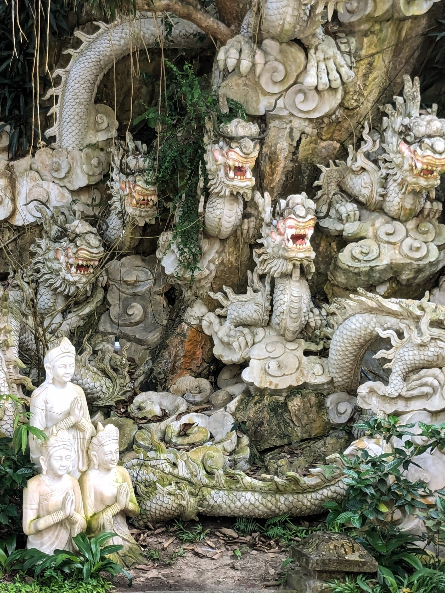
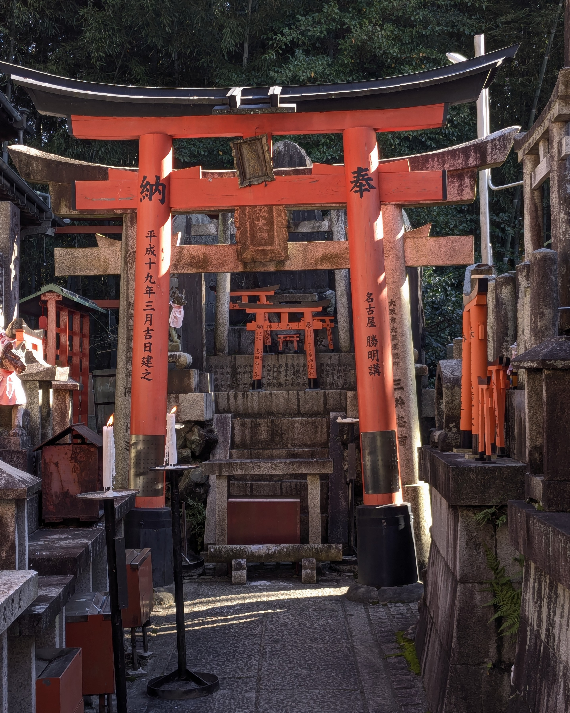
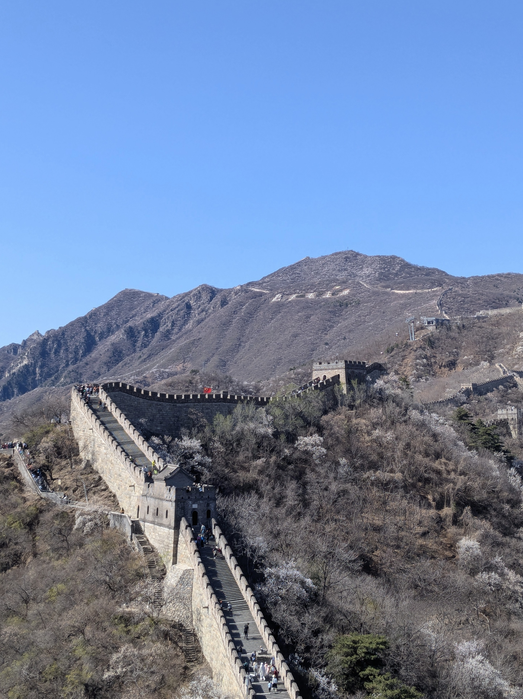
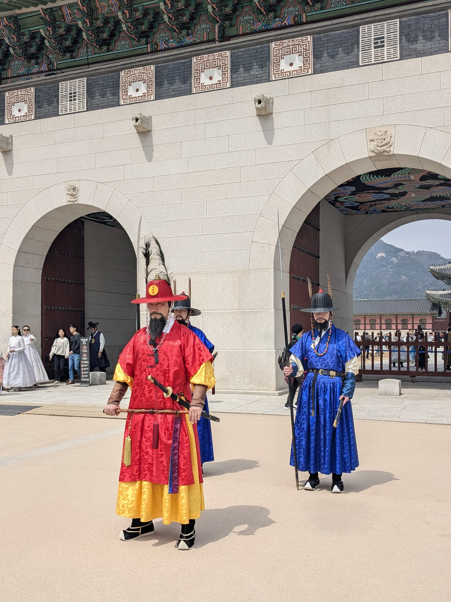

# 👋 Hi, I'm Atharva — Software Engineer | Backpacker

I’m a Software Engineer with a passion for building scalable systems and for exploring the world with nothing but a 7kg backpack. Whether I’m designing high-performance pipelines or catching the wrong train in a new country, I believe in simplicity, intention, and impact.

---

## 💻 About Me

- 👨‍💻 Software Engineer @ Deutsche Bank
- 🧠 3+ years building intelligent document processing systems
- ⚡ Focused on performance, scalability & clean architecture
- 🌍 Exploring the world solo while grounded in engineering excellence

---

## 🛠 Technology

- **Full-Stack:** Python (FastAPI), Java (Spring Boot), TypeScript, React.js, Node.js (Express.js)
- **Cloud & Infra:** GCP, Kubernetes, Docker, PubSub, PostgreSQL
- **Engineering:** API Dev, Distributed Systems, CI/CD, System Design, Linux

---

## 🌍 Backpacking

Backpacking the world with just **7kg** of gear. Travel keeps me adaptable, calm under pressure, and always learning.

> “I don’t always know where I’m going next — sometimes Skyscanner decides. But I always end up where I’m meant to be.”

- ✈️ Since a lot of people are crazy about MBTI type, I am an ENFP.
- 🌿 Why do I travel solo? I value peace and prefer following my own direction.
- 📷 I try to document stories and moments.

---

## ✈️ Countries I've Explored

<table>
  <tr>
    <td align="center" width="180">
      <a href="https://photos.app.goo.gl/Wgmx3ZXvrcz3Aggx5">
         
        <strong> India</strong>
      </a>
    </td>
    <td align="center" width="180">
      <a href="https://your-album-link/vietnam">
         
        <strong> Vietnam</strong>
      </a>
    </td>
    <td align="center" width="180">
      <a href="https://your-album-link/japan">
         
        <strong> Japan</strong>
      </a>
    </td>
    <td align="center" width="180">
      <a href="https://photos.app.goo.gl/ddaLMhaGtfV8GDQeA">
         
        <strong> China</strong>
      </a>
    </td>
  </tr>
  <tr>
    <td align="center" width="180">
      <a href="https://photos.app.goo.gl/Wgmx3ZXvrcz3Aggx5">
         
        <strong> South Korea</strong>
      </a>
    </td>
  </tr>
</table>

---
<!-- 
## 🧭 Philosophy

> I work with intention.  
> I travel with curiosity.  
> I build for impact.

Both in code and in life, I believe in doing more with less — keeping things lightweight, meaningful, and adaptive.

--- -->

## 📫 Let’s Connect

- 💼 [LinkedIn](https://www.linkedin.com/in/atharvakokate/)

